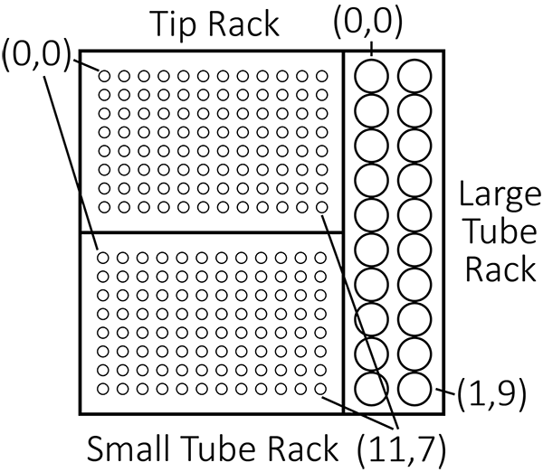

# Construction of a Low-cost Liquid Handling Device with 3D Printing for Polymerase Chain Reaction

This repository contains the source code and instructions for constructing a low-cost automated liquid handling device designed specifically for performing Polymerase Chain Reaction (PCR) tasks. This device is ideal for underfunded laboratories looking for an affordable solution to automate repetitive pipetting tasks. For a clear and concise summary about the project, please read the [Construction of a Low-cost Liquid Handling Device with 3D Printing for Polymerase Chain Reaction.pdf](assets/Construction_of_a_Low-cost_Liquid_Handling_Device_with_3D_Printing_for_Polymerase_Chain_Reaction.pdf)

## Abstract

Although a field still in its infancy, robots, and automated devices have been adopted in an increasing number of laboratories to make the workflow more efficient. However, the high cost of liquid handling devices exacerbates disparities between laboratories. To address this issue, this research developed an accurate and low-cost liquid handler, designed for easy replication through open-source software and 3D designs distributed online. The device was rigorously tested, achieving a systematic error of 2.54% at 5 µL and a random error of 1.82%, yielding an overall accuracy of 97.46% and precision of 98.18%. Polymerase Chain Reaction (PCR) tests and gel electrophoresis analysis confirmed the machine’s capability to accurately perform PCR. With a material cost of approximately $206, this device offers a highly economical alternative to commercial liquid handlers, which typically range from $9,000 to $60,000. This innovation has the potential to significantly benefit underfunded laboratories, providing a cost-effective solution for repetitive PCR processes.

## Construction

The bill of materials and the details about the 3D print components are in the pdf [Liquid_Handler_Materials.pdf](assets/Liquid_Handler_Materials.pdf) (The bill of materials were last updated on Aug 19th, 2024 and the prices might have altered over time). Download the PDF to access the links used to buy each component. The required 3D print files are located in the stl folder.

## Running the Device

1. Clone the directory into the directory you desire by `git clone https://github.com/Jeffrey-Moon/Liquid-Handler.git`
1. Upload the Arduino code Liquid_Handler.ino after connecting the computer to the Arduino using the cable.
1. Plug in the device and turn the device on.
1. Download python if not already and download the required library by either running `pip install pyserial` or `pip install -r requirements.txt`.
1. Run the python code after creating your own sequence.

Example:
`python code/pyserial_control.py  --repetitions 1 2 3 --from_coords 0,0 1,1 2,2 --to_coords 3,3 4,4 5,5 --tube_types B T B`
This would execute a sequence of operations: First, attach a tip, then transfer from big tube (0,0) to small tube (3,3) once. Next, change the tip, then transfer from small tube (1,1) to small tube (4,4) twice. Finally, change the tip, then transfer from big tube (2,2) to small tube (5,5) three times.
--repetitions indicate the number of times the sequence will be executed. --from_coords is the coordinate that the device will pipette from and the --to_coords is the coordinate the device will pipette to. Lastly the --tube_types indicate the tube type for the pipetting. B indicates pipetting from the big tubes to the small tubes and T indicates pipetting from the small tubes to small tubes. The coordinate visualization for the tube racks are as seen below.

